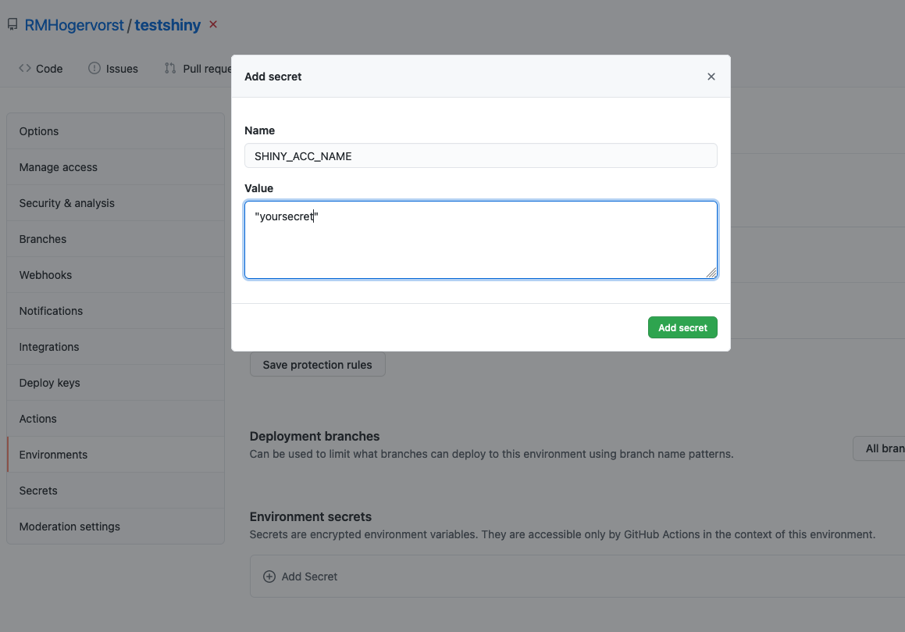

## Auto deploying an app to shinyapps.io


This is the demo shiny app and is very lame, but the major point is 
the github actions that are used here to deploy after each commit in main/master.

This current version is pretty ugly, I could have used a script to set it up.


In your github repo set up your secrets SHINY_ACC_NAME, TOKEN,SECRET,MASTERNAME, and TESTNAME.

In your local .Renviron file 
```
SHINY_ACC_NAME="youraccountname"
TOKEN="atokenyougotfromshinyapps.io"
SECRET="asecretyourecievedfromshinyapps.io"
MASTERNAME="thiswillbethelastpartoftheurl"
TESTNAME="thiswillbethelastpartoftheurl"
```

Your master/main url will be `https://{SHINY_ACC_NAME}.shinyapps.io/{MASTERNAME}/`
and for PRs the URL will be `https://{SHINY_ACC_NAME}.shinyapps.io/{TESTNAME}/`

Set secrets in github in repository secrets



test docker image locally with 

```
IMAGENAME=<NAMETHISSOMETHING>
docker build -t $IMAGENAME . 
docker run --env-file .Renviron $IMAGENAME
```
